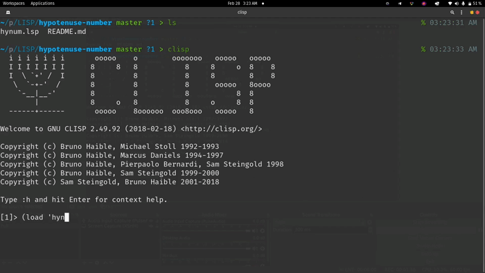

# <b>Hypotenuse Number</b>

Ini adalah program yang dibuat dari bahasa pemrograman LISP yang berfungsi untuk menentukan apakah bilangan-bilangan yang anda input adalah bilangan phytagoras atau tidak.

## <b>How to Use? </b>

Cara menggunakannya antara lain:
1. Buka clisp.
2. Load file ini.
3. Kemudian anda akan disuguhkan pertanyaan.
4. Masukkan angka-angka yang anda ingin cek sesuai dengan permintaan.
5. Tekan enter untuk setiap pertanyaan sampai anda mendapatkan hasilnya.

## <b>About Me</b>

I'm a student at Del Institute of Technology.  
Bachelor of Informatics study program.  

<button><a href="https://www.instagram.com/gabrielhtg77/">My Instagram</a></button>
 
<button><a href="https://www.del.ac.id/">Institut Teknologi Del</a></button>    